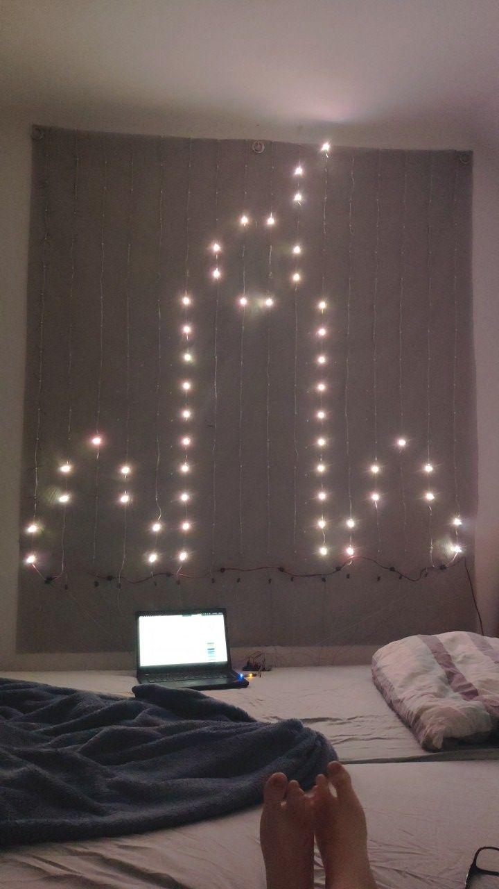

# WS2812B-LED-visualisations
Different visualisations for an 16x16 (you can change that) LED matrix controlled with an AVR.
Comes with an emulator.

Picture of the LED matrix

Video of the Simulator

